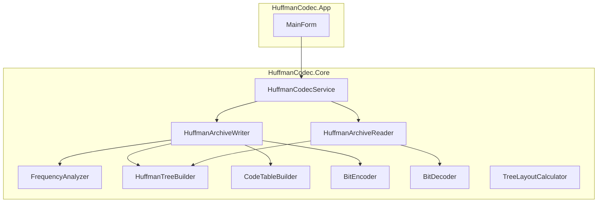

# HuffmanCodec — программа сжатия и распаковки файлов кодом Хаффмана

## 1. Назначение

**HuffmanCodec** — учебное приложение на **C# / .NET 8** с графическим интерфейсом **Windows Forms**. Оно выполняет **без потерь** сжатие произвольного бинарного файла в собственный контейнер с расширением `.huff` и обратную распаковку. Алфавит кодирования — **байты 0..255** (то есть программа работает с файлом как с последовательностью байтов, а не с «буквами Unicode»).

### Ограничения

- Поддерживается только формат **`.huff`** (описан ниже).
- Для очень больших файлов текущая реализация буферизует содержимое в памяти на этапе сжатия/разжатия (достаточно для учебных файлов; для гигабайтных данных потребовалась бы потоковая доработка).

---

## 2. Краткая теория: код Хаффмана

**Префиксный код** — такое отображение символов в последовательности битов, что ни одно кодовое слово не является префиксом другого. Тогда декодирование однозначно: читая биты слева направо, можно по дереву восстановить символы.

**Алгоритм Хаффмана** строит **двоичное дерево**:

1. Каждый символ с ненулевой частотой — **лист** с весом = частота.
2. Пока в лесу больше одного дерева: взять два дерева с **наименьшим** суммарным весом, соединить новым корнем; на рёбрах пометить **0** (к левому потомку) и **1** (к правому).
3. Код символа — последовательность меток на пути от корня к листу.

Средняя длина кода минимизируется для данных частот (оптимальность в классе префиксных кодов для заданного распределения).

### Детерминизм и учебные слайды

При **равных весах** порядок слияний не определён однозначно: разные правила приводят к **разным наборам кодов** с тем же (или близким) коэффициентом сжатия. В проекте зафиксировано:

- очередь с приоритетом по паре **(вес, TieBreakKey)**;
- **TieBreakKey** у листа — это значение байта; у внутреннего узла — **минимум** TieBreakKey потомков;
- при слиянии двух узлов **левым** (ветка `0`) становится узел с **меньшим** `(вес, TieBreakKey)` в лексикографическом порядке.

Поэтому конкретные цепочки `0/1` могут **не совпасть** с рисунком из методички, если там другой порядок равновесных слияний. В тестах проверяются **частоты** (для русской фразы в Windows-1251), **мультимножество длин кодов** для классического примера с весами `a1..a6` и **круговой проход** «сжать → распаковать».

### Пример из методички (русская фраза, Windows-1251)

Для строки в кодировке **Windows-1251** «на дворе трава, на траве дрова» частоты символов-**байтов** совпадают с таблицей на слайде (пробел, буквы, запятая). В **UTF-8** та же фраза дала бы **другие** частоты по байтам — это нормально: программа кодирует **сырой файл**.

---

## 3. Формат файла `.huff`

Все многобайтовые целые — **little-endian**.

| Смещение | Размер | Поле |
|---------:|-------:|------|
| 0 | 4 | Магия `HUFF` (`0x48 0x55 0x46 0x46`) — один и тот же контейнер можно сохранять с расширением `.huff`, `.hfc` или `.hfm` (в приложении — выбор в диалоге сохранения). |
| 4 | 1 | Версия формата, сейчас `1` |
| 5 | 8 | `OriginalLength` — `long`, число байт исходного файла |
| 13 | 1024 | 256 значений `uint` — частоты байтов `0..255` в исходных данных |
| 1037 | *N* | Сжатые биты, упакованные в байты (см. ниже) |
| 1037+N | 1 | `PadBits` — сколько **последних** битов в последнем байте полезной нагрузки являются **дополнением** (0..7) |

**Упаковка битов:** первый записанный бит кода попадает в **старший** бит первого байта полезной нагрузки; далее — к младшему концу байта, затем следующий байт. `PadBits` указывает, сколько битов в конце потока **не** относятся к данным (чтобы байтовая длина была целой).

**Пустой файл:** все частоты нули, `OriginalLength = 0`, полезная нагрузка пуста, `PadBits = 0`.

**Один уникальный байт в файле:** в дереве используется второй **фиктивный** лист с частотой 0 (не встречается в данных), чтобы дерево оставалось двоичным; в заголовке по-прежнему записываются только **реальные** частоты.

---

## 4. Архитектура решения и SOLID

Решение разбито на проекты:

| Проект | Роль |
|--------|------|
| `HuffmanCodec.Core` | Модели, интерфейсы, алгоритм, чтение/запись `.huff` |
| `HuffmanCodec.App` | WinForms: форма, диалоги, строка состояния, индикатор прогресса |
| `HuffmanCodec.Tests` | xUnit: круговой проход, краевые случаи, частоты |

### Зависимости (упрощённо)



- **SRP:** отдельные классы для частот, дерева, таблицы кодов, побитового кодирования/декодирования, записи архива; в Core остаётся и `TreeLayoutCalculator` (при необходимости можно снова подключить отрисовку дерева).
- **OCP:** можно подменить реализацию интерфейса (например, другой контейнер), не меняя остальной код.
- **LSP:** узлы дерева единообразно обходятся кодировщиком и декодировщиком.
- **ISP:** узкие интерфейсы (`IFrequencyAnalyzer`, `IBitEncoder`, …).
- **DIP:** форма зависит от `IHuffmanCodec`; конкретные классы создаются в `Program.cs` (композиционный корень).

---

## 5. Основные типы (Core)

| Тип | Назначение |
|-----|------------|
| `HuffmanNode` | Узел дерева: вес, опциональный байт-лист, левый/правый потомки, `TieBreakKey` |
| `HuffmanCode` | Битовый код: `Bits` и `BitCount` |
| `HuffmanArchiveFormat` | Магия, версия, размер заголовка, расширение по умолчанию |
| `FrequencyAnalyzer` | Подсчёт `uint[256]` по буферу или потоку |
| `HuffmanTreeBuilder` | Построение дерева по частотам, особый случай одного символа |
| `CodeTableBuilder` | Обход дерева → словарь `byte → HuffmanCode` |
| `BitEncoder` / `BitDecoder` | Упаковка/распаковка битового потока с `PadBits` |
| `HuffmanArchiveWriter` / `HuffmanArchiveReader` | Запись и чтение `.huff` |
| `HuffmanCodecService` | Фасад: файлы + `PreviewAsync` для UI |
| `TreeLayoutCalculator` | Координаты узлов/рёбер (в текущей версии UI не используется) |
| `LayoutNode` / `LayoutEdge` | DTO для возможной отрисовки дерева |

---

## 6. Интерфейс пользователя (WinForms)

- **Выбрать файл** — исходник для сжатия; в диалоге фильтры по типам (все файлы, текст, бинарные, изображения).
- **Сжать…** — `SaveFileDialog` с выбором расширения архива: **`.huff`**, **`.hfc`**, **`.hfm`** или любое имя (`*.*`) — формат данных один (магия `HUFF`).
- **Распаковать…** — открытие архива с расширениями **`.huff`/`.hfc`/`.hfm`** или любого файла; сохранение результата с выбором **`.txt`**, **`.bin`**, **`.dat`**, **`.json`**, **`.xml`** или **`*.*`**.

Во время сжатия и распаковки внизу окна показывается **`ProgressBar`** (режим `Continuous`, значения **0–100** по этапам алгоритма через `IProgress<int>` из ядра), кнопки на время операции блокируются.

---

## 7. Сборка и запуск

Пошаговые команды (чистая пересборка, `publish`, PowerShell/cmd, пути к exe): см. **[BUILD.md](../BUILD.md)** в корне репозитория.

Кратко из корня `HuffmanCodec.sln`:

```bash
dotnet build -c Release
dotnet run -c Release --project src/HuffmanCodec.App/HuffmanCodec.App.csproj
dotnet test -c Release
```

Требуется **Windows** (целевая платформа `net8.0-windows` у приложения из-за WinForms).

---

## 8. Краевые случаи и целостность

- Неверная магия или версия → исключение при распаковке.
- `PadBits > 7` → ошибка формата.
- Декодер читает ровно `OriginalLength` байт, двигаясь по дереву; несогласованный файл приведёт к нехватке битов или лишним битам (исключение или повреждённые данные — важно не подавлять ошибки при отладке).

---

## 9. Возможные улучшения (вне текущего объёма)

- Потоковое сжатие без полной загрузки файла в память.
- Сохранение «сырых» частот только для ненулевых байтов для экономии заголовка.
- Параллельное построение частот для SSD.

---

## 10. Лицензия и авторство

Учебный проект института ИТ-направления. Код структурирован с опорой на принципы ООП и SOLID, снабжён краткими комментариями в ключевых местах.
